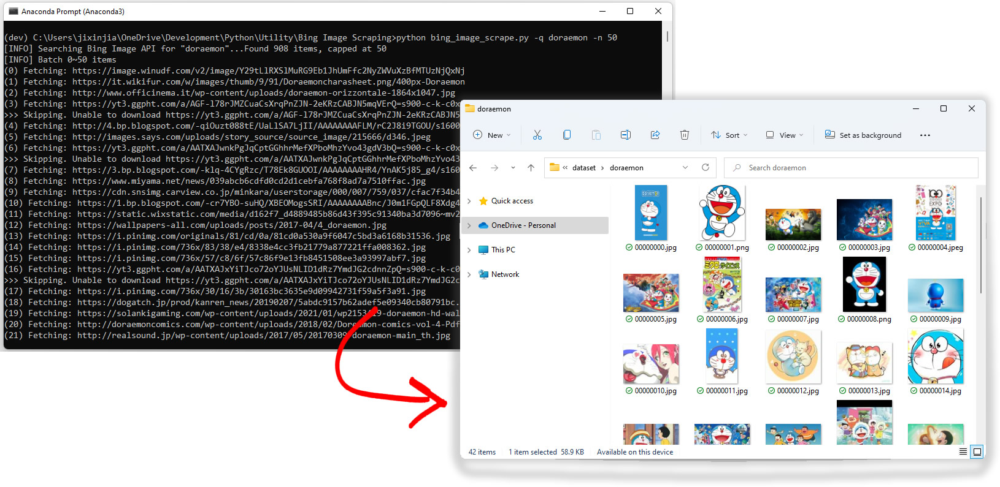

# Bing Image Search Client Utility
A client utility for scraping large sum of images using Bing Search.    
Simplys supply the search query and number of batches to download, let the program handles the rest.

## What does it do

* The porgram finds and downloads images based on your search query from Bing Search
* You can control number of image batches to download per query

## Instruction

1. Get Bing Search subscription (v7) here: https://www.microsoft.com/en-us/bing/apis/pricing
2. Set the API KEY in `config.py`
3. Run `python bing_image_search.py -q 'YOUR QUERY' -n NUM_OF_IMAGES` to scrape and download

## Note
Access to some publicly hosted images by a programmed agent may be rejected by the hosting server.    
This program will automatically skip downloading those images
